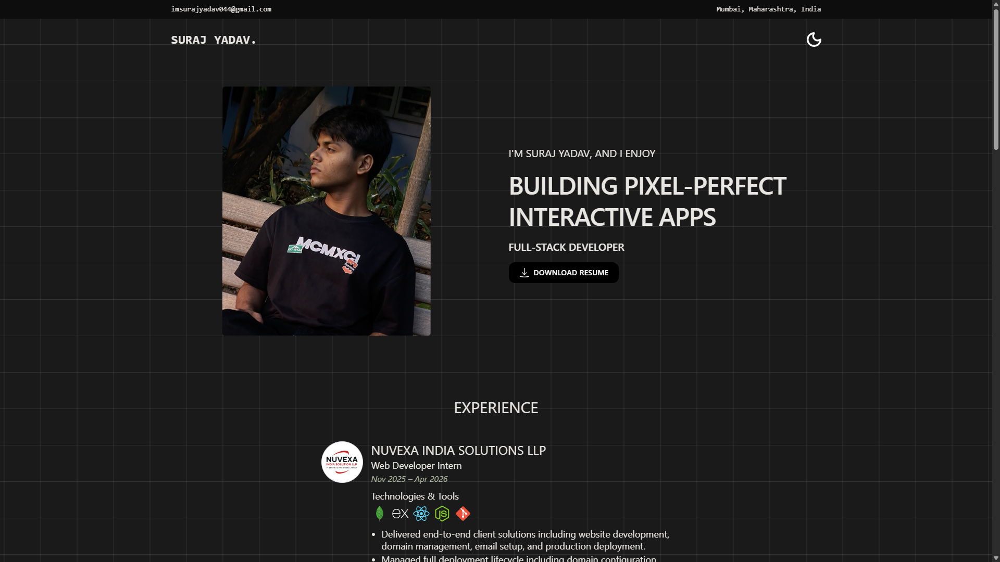
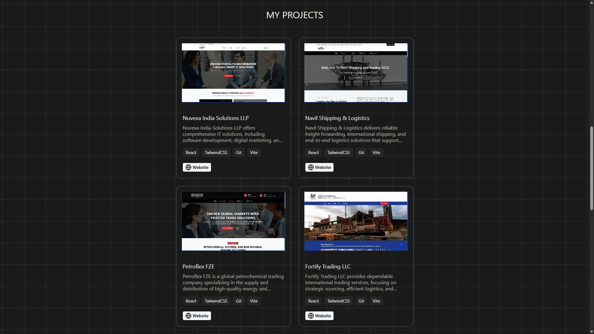

# 🚀 Suraj Yadav – Portfolio Website

A modern developer portfolio built with a focus on smooth animations, clean UI, and performance. Designed to showcase projects, skills, and experience in an engaging and visually appealing way.

---

## 🌐 Live 

🔗 **Live Website:** [Add your live URL here]

---

## ✨ Features

- ⚡ Smooth scrolling powered by **Lenis**
- 🌙 Dark mode support
- 📱 Fully responsive (mobile-first design)
- 🎨 Custom animations using **GSAP**
- 🧑‍💻 Projects showcase section
- 📬 Contact form integration via **Formint**
- 🔍 SEO-friendly structure
- ⚙️ Centralized content management

---

## 🧩 Website Structure

This is a **single-page application (SPA)** with the following sections:

- Header
- Hero / About
- Experience
- Projects
- Tech Stack / Skills
- Contact
- Footer

---

## 🛠️ Tech Stack

### Frontend

- React.js
- Tailwind CSS

### Animations & UX

- Lenis (smooth scrolling)
- GSAP (advanced animations)

### Utilities

- Formint (form handling)

---

## 📸 Screenshots

  
  


---

## ⚙️ Installation & Setup

Clone the repository and run locally:

```bash
npm install
npm run dev
```

---

## 🔐 Form Configuration

No `.env` file is required.

To enable the contact form:

Go to:

```
/src/components/Contact.jsx
```

Find the following:

FORM_ID="your_public_key"

Replace it with your actual **Formint public key**.

---

## 🧠 Data Management

All dynamic content is managed via:

```
/src/config/data.json
```

---

## 🚀 Highlights

- ✨ Smooth, modern UI with custom animations
- ⚡ Optimized scrolling and performance
- 🎯 Clean and scalable architecture
- 🔍 SEO-optimized implementation
- 🧩 Reusable components

---

## 🧑‍💻 About Me

I’m **Suraj Yadav**, a Full Stack Developer passionate about building modern, performant, and user-friendly web applications.

---

## 🔗 Connect With Me

- 💼 [LinkedIn](https://www.linkedin.com/in/suraj-yadav-b15a1b36b/)
- 🔗 [GitHub](https://github.com/surajbruh)

---

## ⭐ Show Your Support

If you like this project, consider giving it a ⭐ on GitHub!

---

## 📝 License

MIT License
